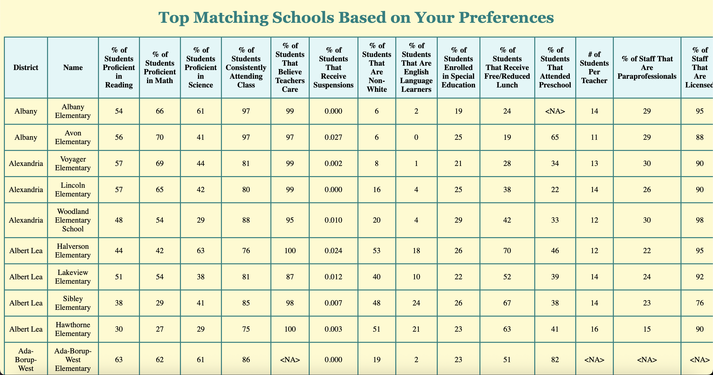

Minnesota Elementary School Matching Program

This project is intended for parents of elementary school-aged children who reside in Minnesota. It pulls and analyzes data from the Minnesota Report Card, and allows parents to sort schools geographically, by certain qualities, and through a quiz where they are able to rank school quality aspects. For example, here is one of the possible quiz outputs:

Link to project: Coming Soon

alt tag

How It's Made:

Tech used: HTML, Python, Jupyter Notebook, CSS

To start out this project, I manuually extracted data from many of the elementary schools listed in the Minnesota Report Card. Once those were saved in Excel, I was able to transport them into Python and get started analyzing my data! 
I started off by creating a basic website with HTML, since I knew that I would want different sorting functions. Afterwards, I created the "Total List of Schools" page, which allowed me to learn how to properly display the table of information in a readable fashion. 
I added this capability to the two other sorting pages ("Sort by Quality" and "Sort by Survey"), but included sorting functions on the dataframe for each. The "Sort by Quality" page function was pretty simple, as I was able to sort the dataframe by the given quality, ascending or descending as needed. The "Sort by Survey" page was a little bit trickier, and it took me a while to figure out the most effective sorting system, but I eventually settled on standardizing the values and creating a weighted numerical scoring to rank the schools. Finally, I knew I wanted to add a geographical sorting section, so I manually entered districts and their surrounding areas into lists using a map of Minnesota districts. Those lists were then added as additional filtering. 
Once all of that was done, all I needed to do was add my sources, clean up the website, and I had the finished product! This is the first website projest that I have completed all by myself, and I am very proud of how it turned out. 

Lessons Learned:

There was definitely a learning curve to this project, and it was an iterative process. I experienced many moments of frustration where I felt like I was stuck in the same place forever (including manually entering every single district), but I feel as though those moments really made me grow as a person. 
One of the biggest things I learned about was how to productively sort using multiple qualities. Originally, I first sorted the list by the top ranked quality, then the second ranked quality, and so on. It didn't take me long to see that this wasn't doing much (since almost all of the numbers in each quality are different), which really upset me, but I was able to tweak the function to do scored sorting instead. Plus, I got to learn something new!
I think above all else, the biggest lesson I learned was that my project didn't need to be super flashy or use all of the coding techniques that I've learned in the last two years. What was most important is that it showcased me and my passions, and I feel like I was able to do that well. 
